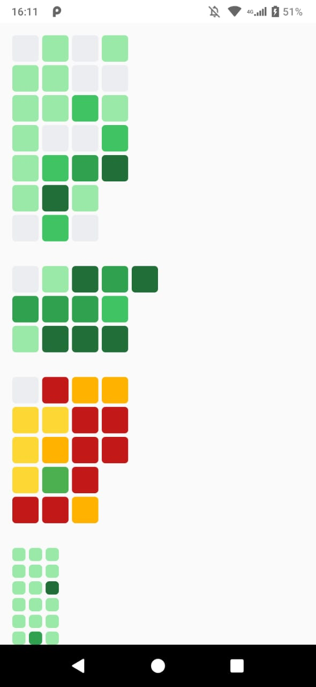

# react-native-heatmap-chart

<p align="center">
  <a href="https://npmjs.org/package/react-native-heatmap-chart"></a>
  <a href="https://npmjs.org/package/react-native-heatmap-chart"></a>
</p>

## Getting started

`$ npm install react-native-heatmap-chart --save`

## Example


```bash
cd example
npm install
react-native run-android
```

<a href="https://github.com/Windows87/react-native-heatmap-chart/tree/master/example/index.js">Click Here</a>

## Basic Usage
```javascript
import React from 'react';
import { View, ScrollView } from 'react-native';
import HeatMap from 'react-native-heatmap-chart';

const App = () => {
  const click = item => {
    console.log(`Value: ${item.value}`);
    console.log(`Index: ${item.index}`);
  };

  return (
    <ScrollView>
      <HeatMap values={[0, 4, 6, 1, 7, 3, 0, 8, 6, 2, 0, 10, 20, 12, 0, 0, 10, 0, 17, 8, 0, 6, 0, 6, 10, 23]} onBlockPress={click} />
    </ScrollView>
  );
};

export default App;
```
  
### Properties

| Prop             | Default                                        | Type     | Description                                                                                                                                                                                           |
|------------------|------------------------------------------------|----------|-------------------------------------------------------------------------------------------------------------------------------------------------------------------------------------------------------|
|  numberOfLines   | `7`                                            | `number` | Number of Horizontal Lines.                                                                                                                                                                           |
| values           | `[]`                                           | `array`  | Your number values.                                                                                                                                                                                   |
| maximumValue     | `"relative"`                                   | `string` | The maximum value of the heatmap. You can select a number (float or integer) or the string "relative" (default). The relative maximum value will use your own values array to find the maximum value. |
| colors           | `['#ebedf0', '#9be9a8', '#30a14e', '#216e39']` | `array`  | Colors of HeatMap.                                                                                                                                                                                    |
| colorsPercentage | `[0, 0.000001, 41, 60, 80]`                    | `array`  | Example: When your value is 60% of maximum, the color will be the index 3 of colors array, 40% will be 2 index, etc. The length of array need to be the same of colors array.                         |
| blocksSize       | `30`                                           | `number` | Size of heatmap blocks (width and height).                                                                                                                                                            |
| indexStart       | `0`                                            | `number` | Start of values index.                                                                                                                                                                                |
| onBlockPress     | `() => {}`                                     | `func`   | On block press. Return an object with properties `{ value, index }`                                                                                                                                   |
| blocksStyles     | `{}`                                           | `object` | Style of blocks.                                                                                                                                                                                      |

## Contribution

<a href="https://github.com/Windows87">@Windows87</a> - Main author